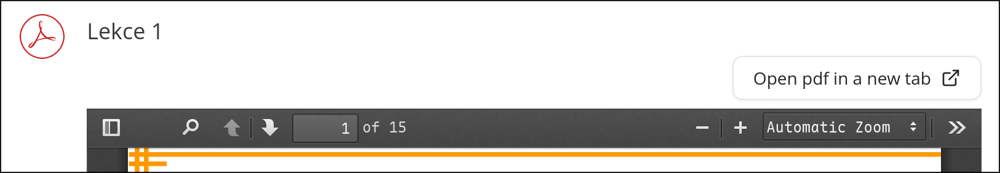
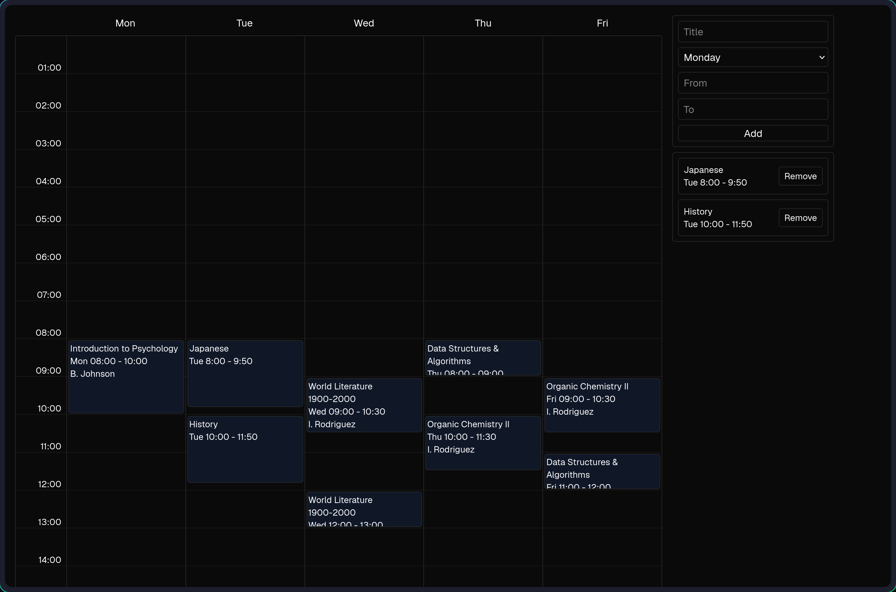
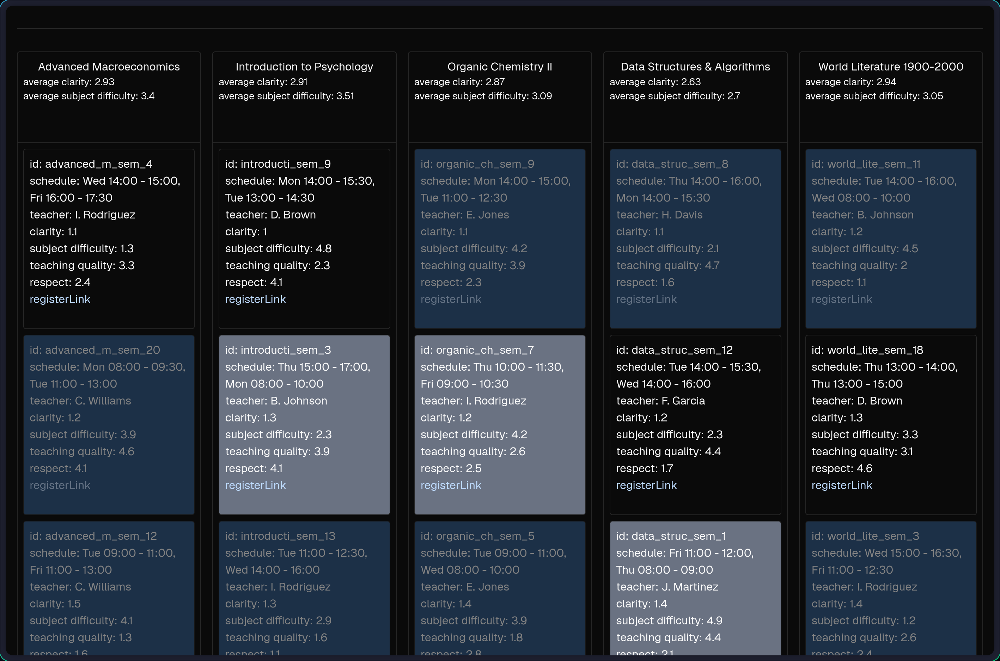

# Enhanced IS
A web extension that enhances [IS](https://is.muni.cz).

This extension improves some aspects of the system that I personally find frustrating. While this is primarily a personal tool, feel free to open an issue if you encounter any bugs or have feature requests.

# Features
## PDF button

Adds a button that can opens the direct PDF in a new tab for subjects **IB000** and **PB154**.

## Seminar overview

- **Unified View:** See all available seminar groups in a single, intuitive interface.
- **Teacher Ratings:** Integrated teacher ratings help you choose the best instructors.
- **Custom Events:** Manually add custom events (like lectures or study blocks) to see how they fit your schedule.
- **Smart Selection:** Easily toggle between different seminar groups to find the perfect fit.
- **Collision Handling:** Detects and visualizes time conflicts between subjects to prevent invalid schedule combinations.

> [!NOTE]
> The calendar is not perfect and should not be considered 100% accurate. For example, it does not take into account seminars that are once per two weeks etc.

# Installation
## Chromium
1. Download the latest [release](https://github.com/Ev357/enhanced-is/releases/latest) `.zip` file.
2. Go to `chrome://extensions`.
3. Enable **Developer mode**.
4. Drag and drop the **zip** file into the page.

## Firefox
> [!NOTE]
> You must use **[Firefox Developer Edition](https://www.firefox.com/en-US/channel/desktop/developer)**, **[Nightly](https://www.firefox.com/en-US/channel/desktop)**, or **[ESR](https://www.firefox.com/en-US/browsers/enterprise)** for a permanent installation. I can add the extension to the official Firefox Add-ons and Chrome Web Store in the future but for now I prefer a clear local installation.
1. Download the latest [release](https://github.com/Ev357/enhanced-is/releases/latest) `.zip` file.
2. Go to `about:config`.
3. Set `xpinstall.signatures.required` to `false`.
4. Go to `about:addons`.
5. Click the **gear** icon and select **Install Add-on From File...**.
6. Select the **zip** file.

# Future plans
- Something to automatically fire registration links.
- Ability to select a secondary seminar if the first one gets full.
- Lots of UI improvements.
